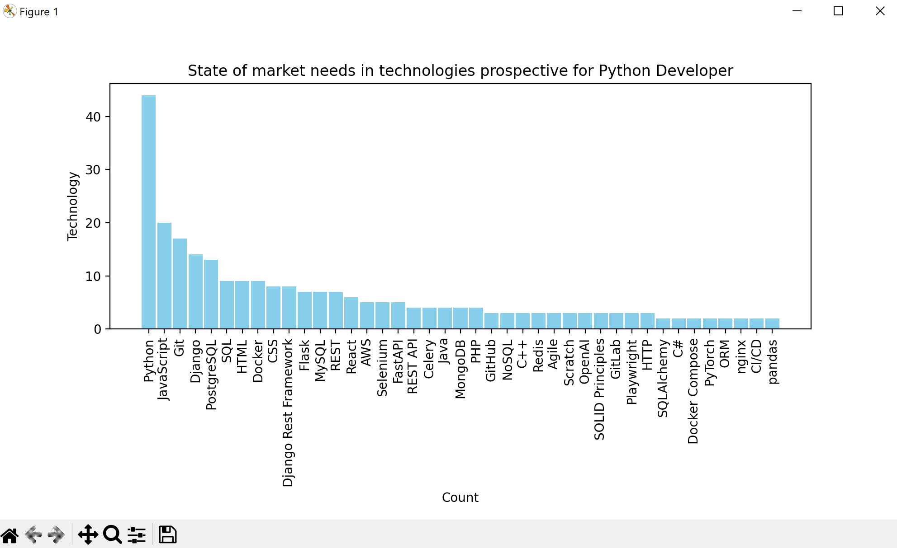

# Python technologies statistics

Project to create the most demanded technologies statistics, based on WORK.ua vacancies for Python Developers.
This project is a combination of Web Scraping & Data Analysis skills.

## Installing using GitHub:

```
git clone git@github.com:MKeSiMu/scrape-vacancies-and-analyze-technologies.git
python -m venv venv
source venv/bin/activate
pip install -r requirements.txt
set SECRET_KEY=<your secret key>
python main.py
```

## Result

